# DSO202 Assignment 1: Three-Tier Task Tracker on Kubernetes

| | |
|---|---|
| Name | Tandin Zangmo |
| Student no. | 02230305 |
| Module | DSO202: Scaling, Orchestration, Monitoring & Observability (Unit I) |
| Cluster | kind cluster `dso202`, Kubernetes v1.36.1, single node `dso202-control-plane` |
| Namespace | `dso202-assignment-01` |
| Images | `sarojsanyasi/dso202-frontend:1.0`, `sarojsanyasi/dso202-backend:1.0`, `sarojsanyasi/dso202-db:1.0` |

## Contents

1. Architecture note (Task 1)
2. Configuration and Secrets (Task 2)
3. Tier deployment and verification (Tasks 3 to 5)
4. Resource governance (Task 6)
5. Verification and interactivity (Task 7)
6. Issues encountered
7. Bonus: namespace RBAC (Task 8)
8. Repository layout and evidence index

---

## 1. Architecture note (Task 1)

When a Deployment manifest is applied with kubectl, the request goes to the kube-apiserver, which validates it and stores the desired state in etcd. The Deployment controller in kube-controller-manager sees the new Deployment and creates a ReplicaSet, and the ReplicaSet controller creates the Pod. The kube-scheduler then picks a node for the unscheduled Pod. The cluster has a single node, dso202-control-plane, so every Pod is placed there. On that node the kubelet sees the Pod assigned to it and asks the container runtime, containerd, to start the container. The images were built locally and loaded into the node with kind load, so containerd used them without pulling. The kube-proxy component on the node maintains the rules that send traffic addressed to a Service's ClusterIP to a Pod behind it. The same chain applies to the database, backend and frontend Pods, and if a Pod is deleted the ReplicaSet notices and creates a replacement.

The database tier uses a Deployment with one replica and the Recreate strategy, a PersistentVolumeClaim, and a headless Service. The PVC is mounted at /var/lib/postgresql/data so the data outlives any single Pod; without it the tasks would be lost whenever the Pod is replaced. Recreate is used because a ReadWriteOnce volume must not be attached to two Pods at once. The headless Service (clusterIP: None) gives the database a stable DNS name, db-svc, that resolves straight to the Pod and is reachable only inside the namespace.

The backend uses a Deployment and a ClusterIP Service. The Service gives the backend a stable internal name and address, backend-svc, even when its Pod is replaced, and because it is ClusterIP it cannot be reached from outside the cluster. The frontend uses a Deployment and a NodePort Service, because it is the only tier that needs to be reached from outside; port 30080 is mapped from the host into the kind node through extraPortMappings in kind-config.yaml.

The Namespace keeps all resources for this assignment together and separate from other work. The ConfigMap holds non-sensitive settings and the Secret holds the credentials, so that passwords are kept out of the Deployment manifests.

Request flow, as observed: the browser loads the page and config.js from the frontend Pod through NodePort 30080. The page's JavaScript then calls BACKEND_URL itself, from the browser, not from the frontend Pod. That hop is the one that fails from outside the cluster (section 6). Inside the cluster the chain is backend-svc, backend Pod, db-svc, database Pod, and db-pvc.

The kind cluster was created with the port mapping needed for the NodePort (containerPort and hostPort 30080) and comes with a default StorageClass, `standard`, which the PVC uses:

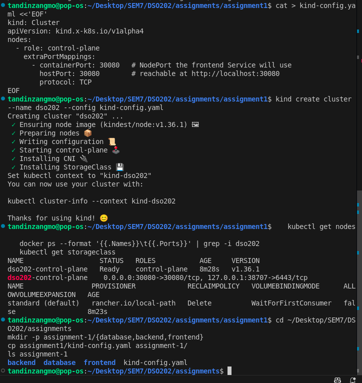

## 2. Configuration and Secrets (Task 2)

| Key | Object | Consumed by |
|---|---|---|
| DB_HOST, DB_PORT, DB_NAME, APP_PORT, CORS_ORIGIN | ConfigMap `app-config` | backend |
| POSTGRES_DB | ConfigMap `app-config` | database |
| BACKEND_URL | ConfigMap `app-config` | frontend |
| DB_USER, DB_PASSWORD | Secret `app-secret` | backend |
| POSTGRES_USER, POSTGRES_PASSWORD | Secret `app-secret` | database |

DB_NAME equals POSTGRES_DB, DB_USER equals POSTGRES_USER, and DB_PASSWORD equals POSTGRES_PASSWORD, because the backend and the official Postgres image use different variable names for the same values. DB_HOST is `db-svc`, the name of the database Service. The Deployments list each key explicitly, so the backend receives only DB_* and the database receives only POSTGRES_*.

**Secret caveat:** Kubernetes Secrets are only base64-encoded, not encrypted at rest by default. Base64 is an encoding that anyone can reverse (for example with base64 -d), so it hides nothing from a person who can read the Secret object or the secret.yaml file. In this assignment the values in secret.yaml are therefore readable by anyone with access to the repository or to the namespace, and the password used here is a classroom value that is not reused anywhere else. Protecting Secrets properly (encryption at rest, restricted RBAC, or an external secret store) is outside the scope of this assignment and was not attempted.

## 3. Tier deployment and verification (Tasks 3 to 5)

**Database (Task 3).** The PVC `db-pvc` (1Gi, ReadWriteOnce, StorageClass `standard`) stayed Pending until the database Pod was scheduled, which is expected because the StorageClass uses WaitForFirstConsumer binding, and then became Bound. `db-svc` shows CLUSTER-IP `None` (headless). The Postgres log says the system is ready to accept connections, and `\dt` inside the Pod lists the `tasks` table created by the image's seed script, owned by the user from the Secret. This shows the POSTGRES_* values were consumed correctly.

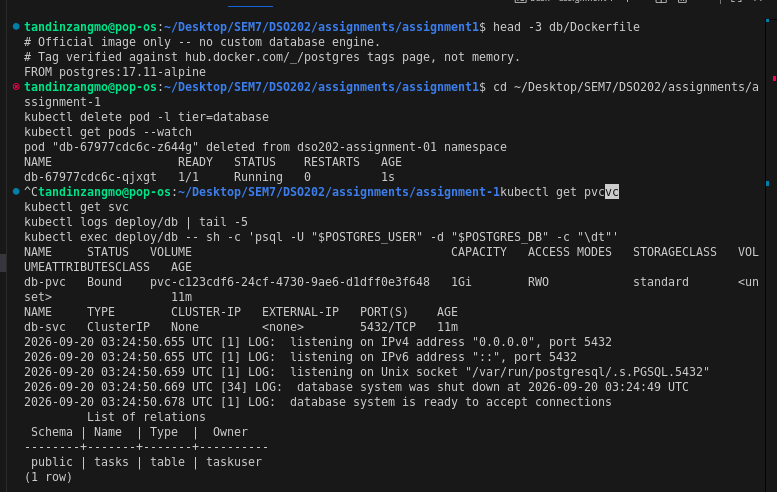

**Backend (Task 4).** The backend logs show `[db] connected` and `[server] listening on :8080`, so the DB_* values, including DB_HOST=db-svc, work. `backend-svc` is of type ClusterIP.

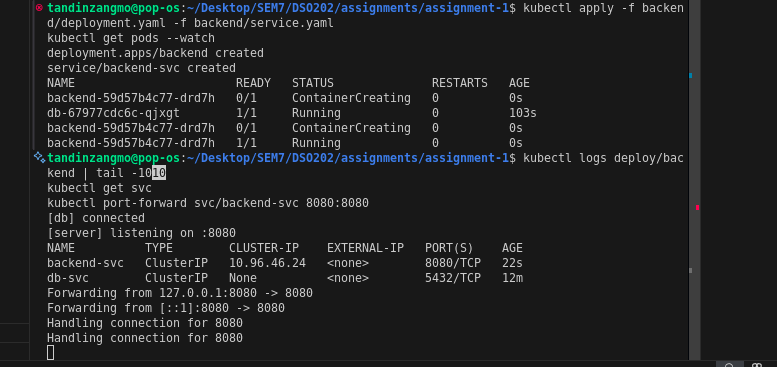

Through a port-forward, `/api/status` returned HTTP 200 with `{"status":"ok","db":"connected"}`:

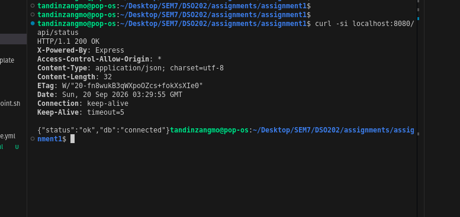

**Frontend (Task 5).** The frontend Deployment reads BACKEND_URL from the ConfigMap, and frontend-svc is a NodePort Service on 30080, matching the kind port mapping. The page is served at http://localhost:30080.

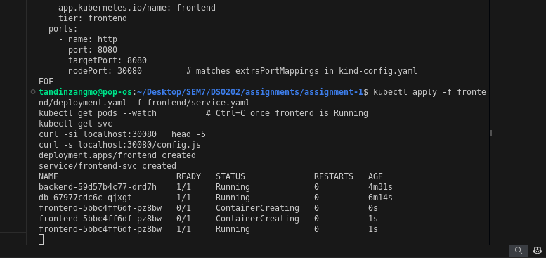

All Pods, Deployments and Services carry a `tier` label (`database`, `backend` or `frontend`); the labels are visible in the `--show-labels` output in section 5 (7d).

## 4. Resource governance (Task 6)

| Tier | CPU request | Memory request | CPU limit | Memory limit |
|---|---|---|---|---|
| db | 100m | 256Mi | 500m | 512Mi |
| backend | 50m | 64Mi | 250m | 128Mi |
| frontend | 25m | 32Mi | 100m | 64Mi |
| Total | 175m | 352Mi | 850m | 704Mi |

ResourceQuota `assignment-quota`: requests.cpu 500m, requests.memory 1Gi, limits.cpu 2, limits.memory 1536Mi, pods 10, persistentvolumeclaims 2, requests.storage 2Gi, services.nodeports 1, services.loadbalancers 0. LimitRange `assignment-limits` (per container): default request 50m/64Mi, default limit 200m/128Mi, minimum 10m/16Mi, maximum 500m/512Mi.

The observed quota usage matched the totals above exactly (175m, 352Mi, 850m, 704Mi, 3 Pods, 1 PVC, 1 NodePort):

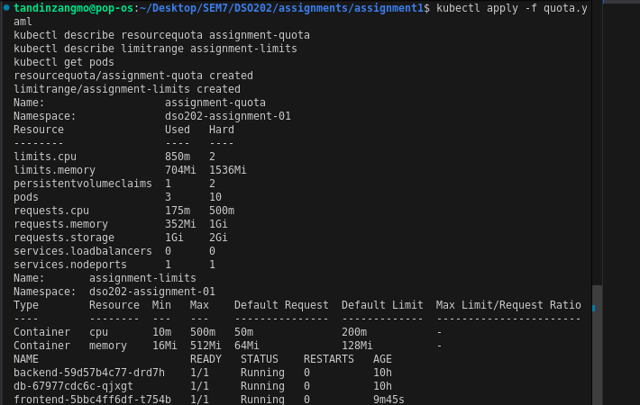

**Justification.** The requests and limits were sized per tier. The database gets the most because PostgreSQL is the heaviest process. The backend is a small Node.js API, and the frontend is only nginx serving static files, so it gets the least. These are estimated starting values, not measured from load testing. All three Pods ran with 0 restarts for more than 10 hours, so none was killed for exceeding its memory limit; CPU throttling was not measured because the cluster has no metrics-server.

The ResourceQuota was set to roughly two to three times the steady-state totals so that a replacement Pod is not blocked while an old Pod is still terminating, as seen in test 7c, or during a rolling update. The pods limit of 10 allows the three running Pods plus this overlap and a few temporary test Pods. The PVC limit of 2 and storage limit of 2Gi allow the single 1Gi database claim with room to spare. services.nodeports is 1 and services.loadbalancers is 0, so the quota itself enforces the rule that only the frontend is exposed externally.

The LimitRange applies to every container in the namespace. Its maximum equals the database limit because the database is the largest container, so no container may be given more than that. Its minimum rejects accidental near-zero values. Its defaults apply only to a container that declares no values, which matters because a quota on CPU and memory rejects Pods that have no requests or limits. All three of my Deployments set their own values explicitly, so the defaults act as a safety net.

## 5. Verification and interactivity (Task 7)

Text transcripts of every step are in the `evidence/` folder; screenshots are shown below.

### 7a. Full CRUD cycle

I ran kubectl port-forward svc/backend-svc 8080:8080 and used curl against localhost:8080. A POST to /api/tasks created a task with id 4 and status pending. A GET on /api/tasks listed all four tasks, including the new one. A PUT on /api/tasks/4 changed the description and set the status to done, and a GET on /api/tasks/4 confirmed the change. A DELETE on /api/tasks/4 returned 204 No Content, and a following GET returned 404 Not Found, so the task was gone. I used the backend through port-forward because the frontend cannot reach the backend from a browser (section 6). The port-forward only opens a temporary tunnel from my machine; backend-svc remains a ClusterIP Service.

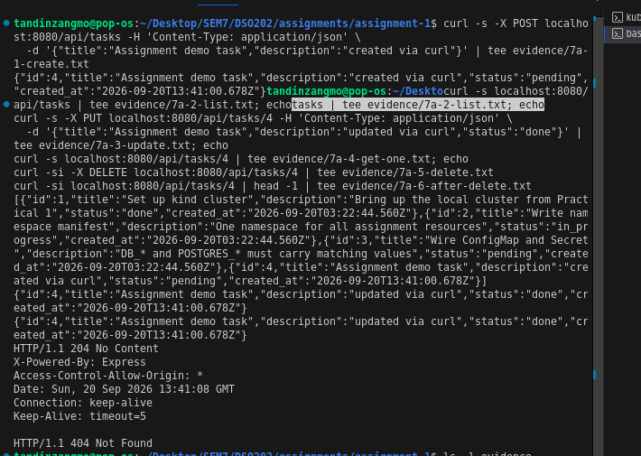

### 7b. Service DNS resolution

From inside the frontend Pod I ran `kubectl exec deploy/frontend -- curl -s http://backend-svc:8080/api/status`. It returned {"status":"ok","db":"connected"}, so the name backend-svc was resolved by cluster DNS and the backend answered, which also confirms the backend can reach the database. I then ran nslookup backend-svc in the same Pod. The DNS server was 10.96.0.10 and it resolved backend-svc.dso202-assignment-01.svc.cluster.local to 10.96.46.24, which matches the CLUSTER-IP of backend-svc. The NXDOMAIN lines are for other suffixes in the Pod's DNS search list, which this nslookup tool tries as well; they do not mean the lookup failed. The "exit code 1" at the end is reported by kubectl exec for the nslookup command.

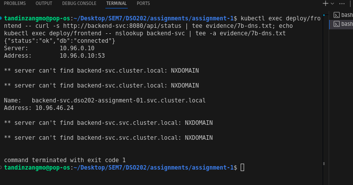

### 7c. Self-healing and data persistence

I started kubectl get pods --watch and created a task ("Survives pod deletion", id 5) through the backend. I then deleted the backend Pod backend-59d57b4c77-drd7h. The watch showed it go to Terminating while the ReplicaSet created a replacement, backend-59d57b4c77-x7nvf, which went Pending, ContainerCreating and Running within about a second. The two Pods share the ReplicaSet prefix 59d57b4c77, which shows the same ReplicaSet recreated it. The old Pod briefly showed an Error status as its container exited during termination (see evidence/7c-backend-watch.txt).

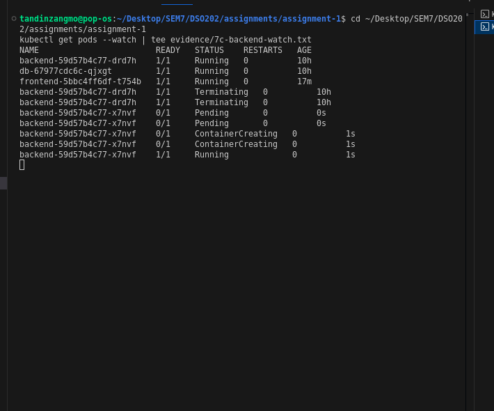

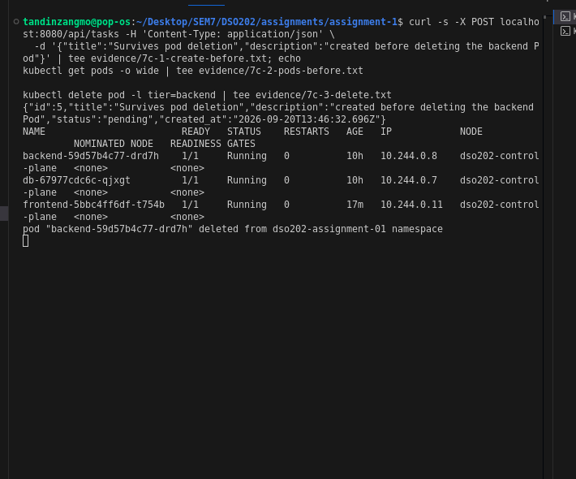

After restarting my port-forward (it had been attached to the deleted Pod), the task with id 5 was still returned. The backend stores nothing itself, so this shows the data lives in the database tier.

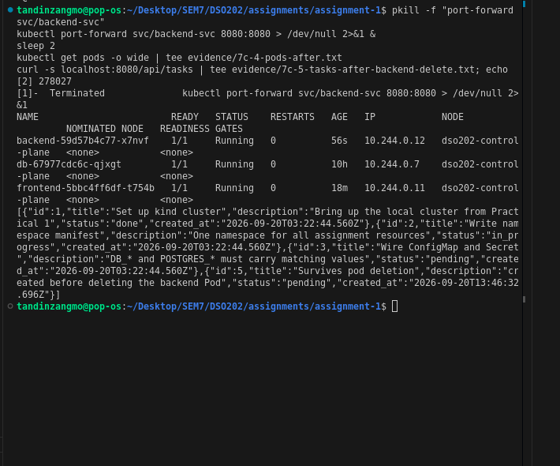

To test the PersistentVolume directly, I also deleted the database Pod db-67977cdc6c-qjxgt. It was replaced by db-67977cdc6c-zqzg4, the PVC db-pvc stayed Bound throughout (10 hours old), and task 5 was still returned afterwards. This shows the Pod lifecycle and the PersistentVolume lifecycle are independent. The database Deployment uses the Recreate strategy because a ReadWriteOnce volume must not be attached to two Pods during a rollout.

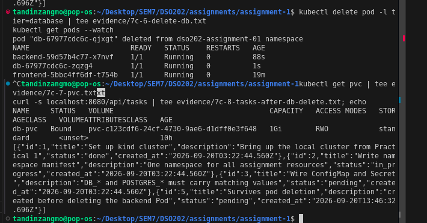

### 7d. Declarative vs imperative

I compared the backend Service. The declarative version is created from backend/service.yaml with `kubectl apply -f`; re-applying the file printed `service/backend-svc unchanged`. The imperative version was created with `kubectl expose deployment backend --name=backend-svc-imperative --port=8080 --target-port=8080 --type=ClusterIP`, and I deleted it afterwards. The `--show-labels` output shows both Services carrying `tier=backend`, and the other Services carrying `tier=database` and `tier=frontend`.

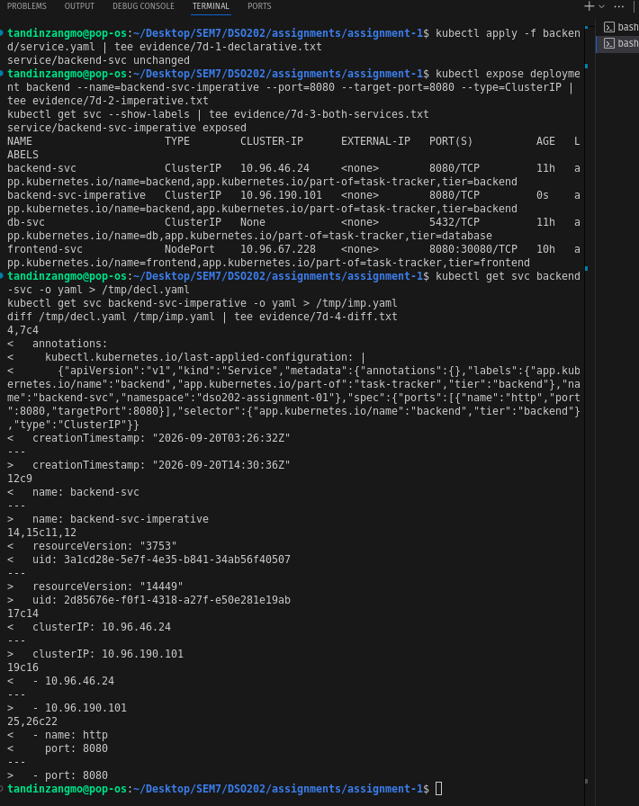

The diff shows: the declarative Service has the kubectl.kubernetes.io/last-applied-configuration annotation, which apply uses to work out later changes, and the imperative one does not. The declarative Service has a named port (http) while the imperative port has no name, because kubectl expose has no flag for it. The name, uid, clusterIP, resourceVersion and creationTimestamp differ, as they always do. The labels and selector were identical, because kubectl expose copies them from the Deployment.

The declarative approach keeps the full desired state in a YAML file that is reviewed and versioned in Git and can be applied again to get the same result. The imperative approach is quicker for a single command, which is useful for experiments and quick fixes, but its result depends on flags and on the Deployment it copies from, the port name could not be set, and nothing in version control records it. For that reason all submitted resources are declarative. The imperative Service was removed afterwards, leaving only backend-svc, db-svc and frontend-svc:

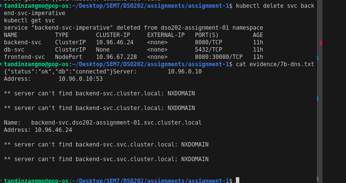

## 6. Issues encountered

**Published images are linux/arm64 only.** The Pod events showed `no match for platform in manifest`, and `docker buildx imagetools inspect` on all three images lists only linux/arm64 (plus an attestation entry). My machine is linux/amd64, so the images could not be pulled.

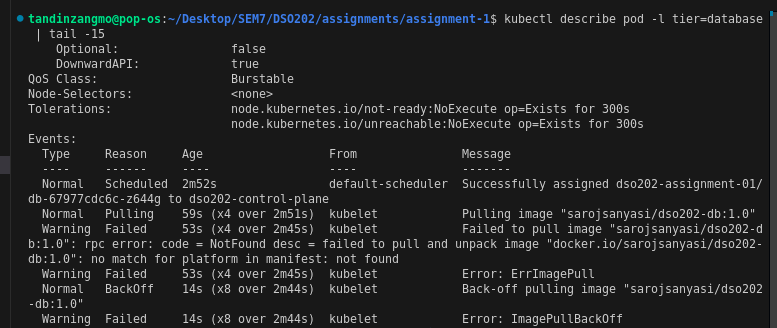

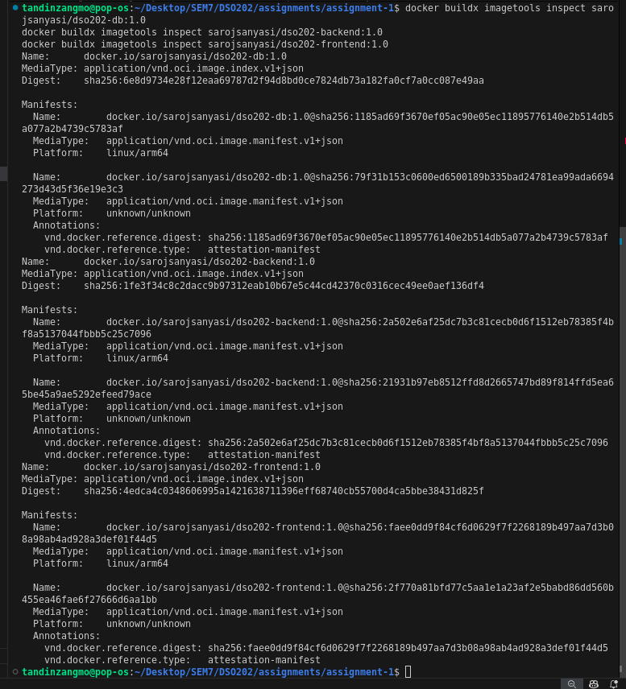

As a workaround I built the unmodified tutor source locally with the same image names and tag 1.0 and loaded the images into the kind node with `kind load docker-image`. The manifests still use `sarojsanyasi/dso202-*:1.0` and imagePullPolicy IfNotPresent. No source file was changed. Tutor informed: **[EDIT: yes on <date>, or not yet]**.

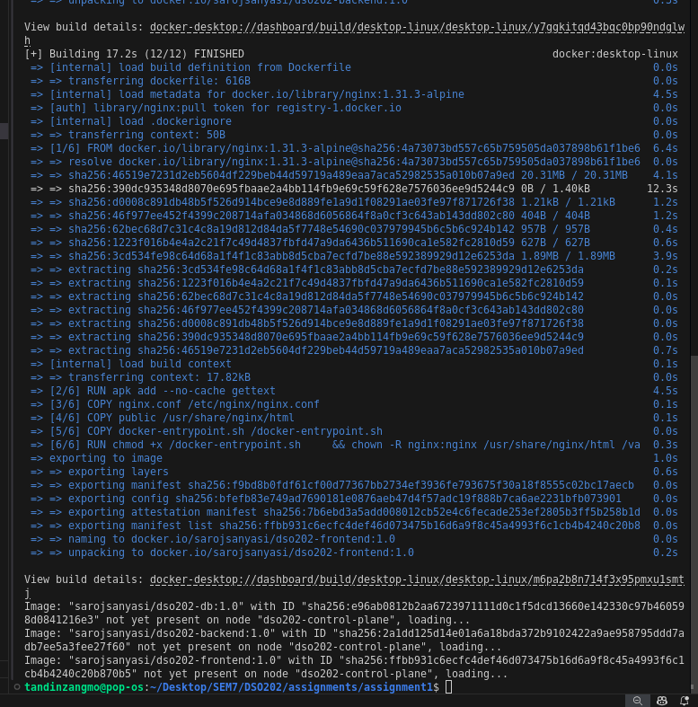

**The frontend cannot reach the backend from a browser.** With BACKEND_URL set to the cluster-internal address, as the brief requires, the page at http://localhost:30080 shows "Backend unreachable" and "Failed to fetch", both when loading the task list and when creating a task.

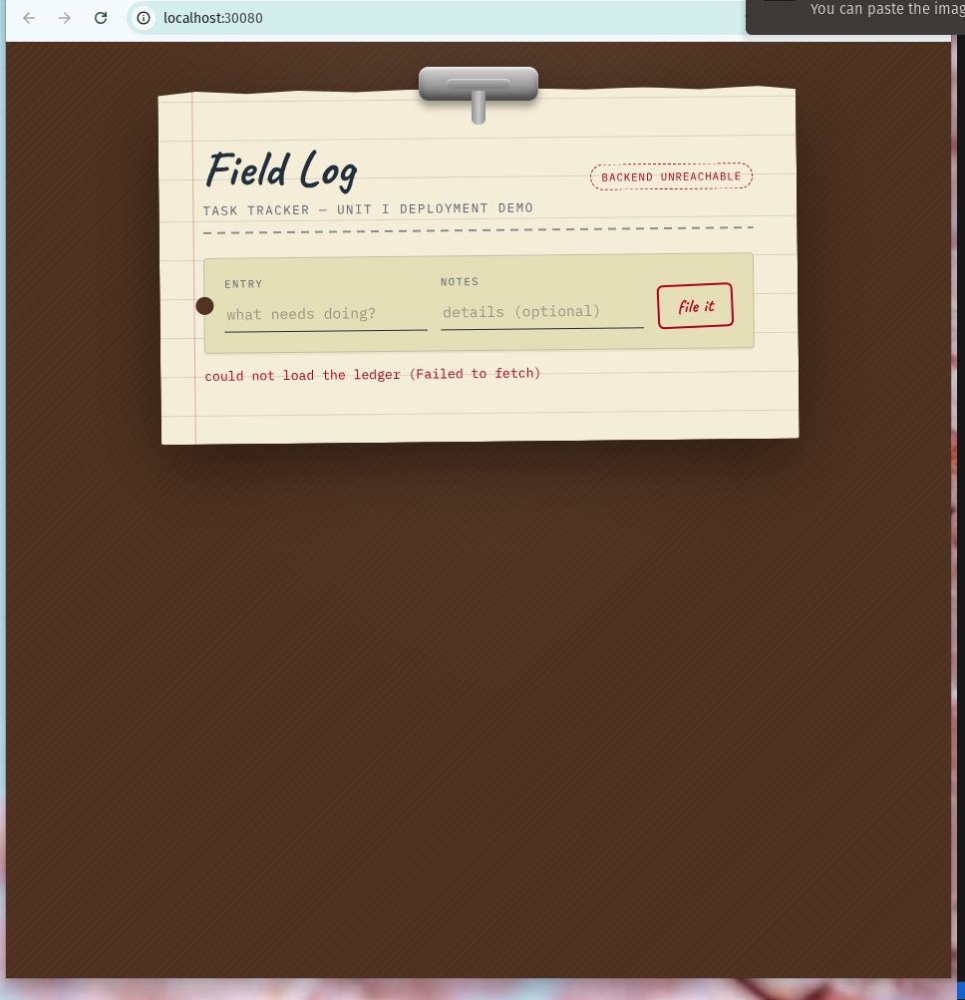

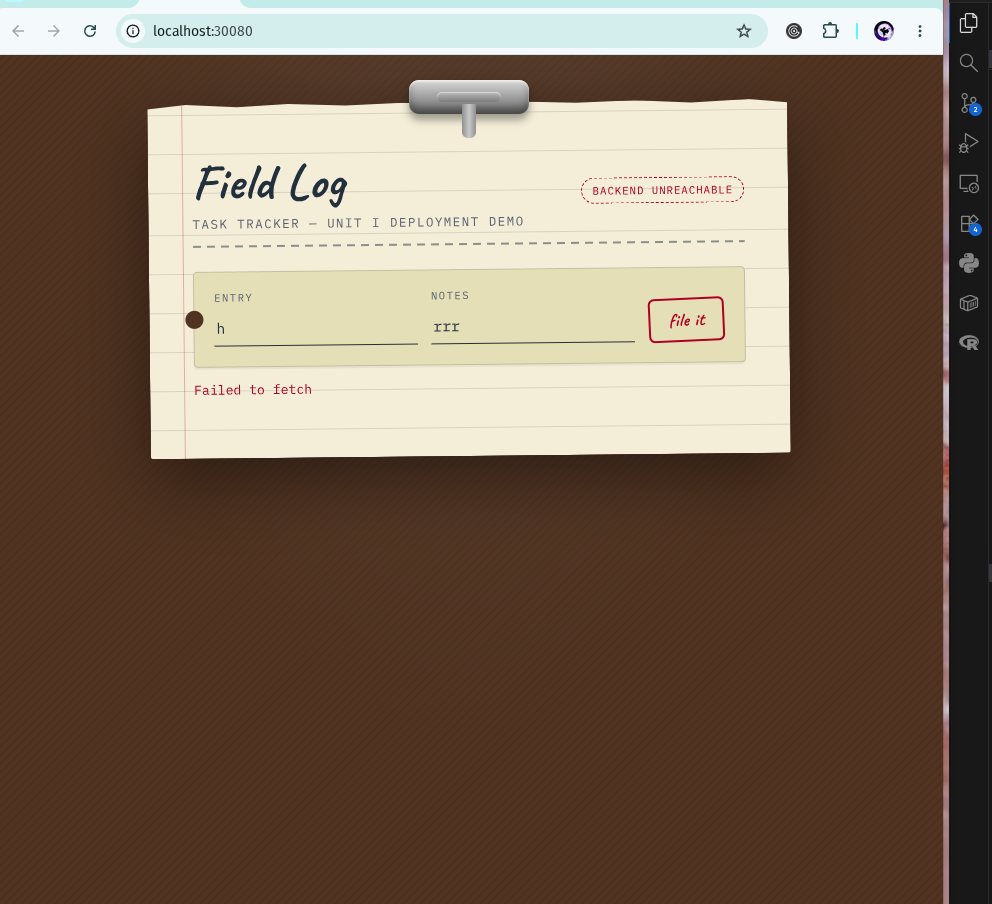

The cause is in the image, not the manifests. config.js contains BACKEND_URL "http://backend-svc:8080", so the value from the ConfigMap did reach the container. But app.js builds every request as `${BACKEND_URL}/api/...`, so the browser on my laptop calls that address itself, and the name backend-svc only resolves inside the cluster. nginx.conf has no proxy for /api, and a request for /api/status on port 30080 returns the HTML page instead of JSON.

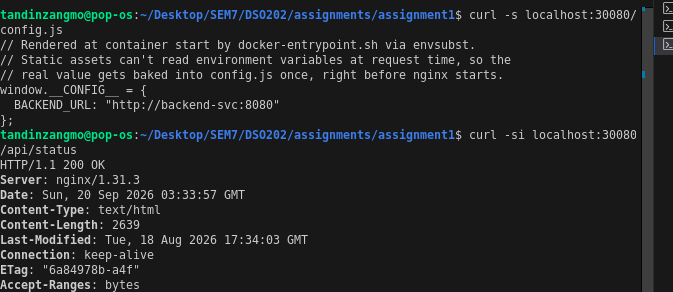

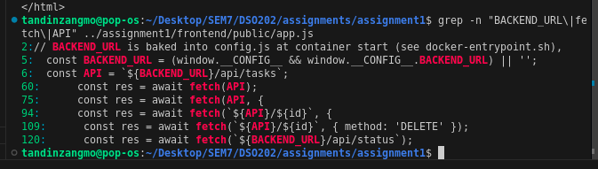

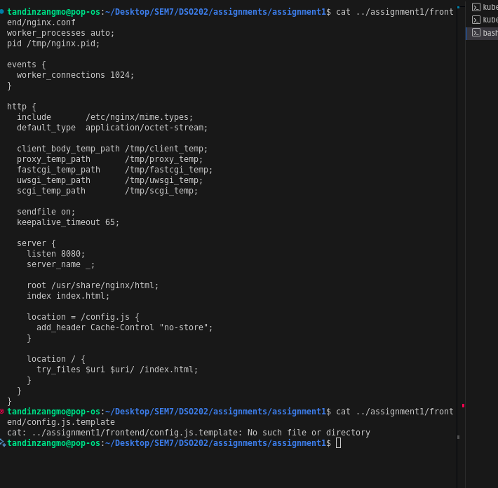

The backend must never be reachable from outside the cluster, so I did not expose it or change the manifests. I demonstrated CRUD through a port-forward instead (7a). To show that the application itself works, I temporarily overrode BACKEND_URL on the frontend with `kubectl set env` to http://localhost:8080 while a port-forward to backend-svc was running. The UI then showed "BACKEND + DB ONLINE" with the seed tasks:

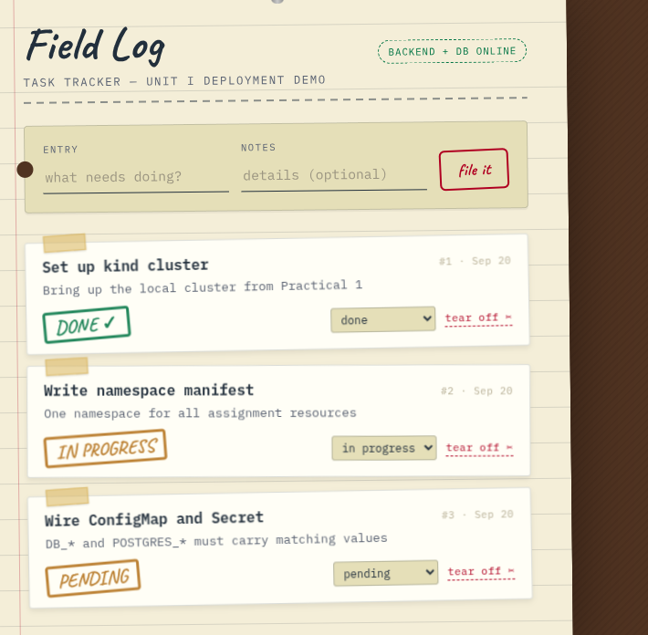

I then reverted it: `kubectl apply` fails after `kubectl set env` ("valueFrom may not be specified when value is not empty"), so I deleted the Deployment and applied frontend/deployment.yaml again. The Deployment reads BACKEND_URL from the ConfigMap again and config.js shows http://backend-svc:8080. No manifest in this repository contains localhost.

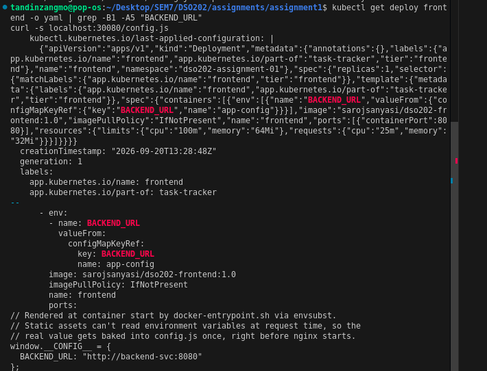

**kind nodes stop when the machine restarts.** The kind node is a Docker container. After a restart the cluster is brought back with `docker start dso202-control-plane` followed by `kind export kubeconfig --name dso202`.

## 7. Bonus: namespace RBAC (Task 8)

rbac.yaml creates a ServiceAccount (viewer-sa), a Role (namespace-viewer) and a RoleBinding (viewer-sa-binding), all in dso202-assignment-01. The Role allows only get, list and watch on Pods, Pod logs, Services, Endpoints, ConfigMaps, PVCs, Events, Deployments and ReplicaSets. I left Secrets out on purpose so the read-only account cannot read the credentials. I checked the result with kubectl auth can-i, impersonating the ServiceAccount: it could list Pods, get Deployments and read Pod logs in the namespace (three "yes"), but could not delete Pods, create Deployments, read Secrets, or list Pods in the default or kube-system namespaces (five "no"). A Role only applies inside its own namespace, which is why access in other namespaces is denied. Transcripts: evidence/8-rbac-can-i.txt and evidence/8-rbac-objects.txt.

## 8. Repository layout and evidence index

```
namespace.yaml   configmap.yaml   secret.yaml   quota.yaml   rbac.yaml   kind-config.yaml
database/   pvc.yaml  deployment.yaml  service.yaml
backend/    deployment.yaml  service.yaml
frontend/   deployment.yaml  service.yaml
evidence/   text transcripts (7a-*, 7b-*, 7c-*, 7d-*, 8-*) and screenshots/
README.md
```

| Task | Evidence |
|---|---|
| 1 Namespace and architecture | section 1; namespace.yaml |
| 2 ConfigMap and Secret | section 2; configmap.yaml, secret.yaml |
| 3 to 5 Tiers | section 3; database/, backend/, frontend/ |
| 6 Quota and LimitRange | section 4; quota.yaml |
| 7a to 7d | section 5; evidence/7a-* to 7d-* |
| 8 RBAC (bonus) | section 7; rbac.yaml; evidence/8-* |
